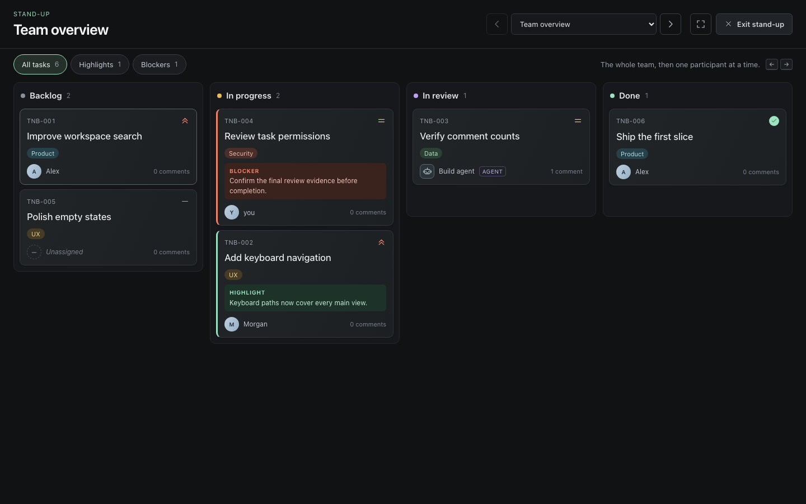

# TasknBoard

A lightweight Kanban workspace for small teams and coding agents.



React + Vite, Node.js, SQLite, a Tauri desktop shell, and an MCP stdio server. One application core owns validation, leases, optimistic concurrency and activity events. No cloud AI dependency.

## Run locally

Requires Node.js **24 or later** and npm. From this directory:

```bash
npm ci
npm run build
npm start
```

Open **http://127.0.0.1:4310**. Data is stored in `data/tasknboard.sqlite` by default. No account or internet connection is needed after installing dependencies.

Optional demo tasks, on an empty database:

```bash
npm run seed
```

Development: keep `npm start` running and run `npm run dev` in another terminal; open http://127.0.0.1:5173. The Vite proxy uses the same API. `npm test` runs domain, persistence, MCP protocol and authenticated HTTP tests.

Browser regression tests use Playwright and the production HTTP service:

```bash
npx playwright install chromium
npm run build
npm run test:ui
```

The browser suite creates temporary SQLite files outside `data/` and removes them
when the tests finish. It does not use the user's workspace database.

The sidebar lists your boards, as Linear lists teams. Expand a board to open its Board, Epics, or Views page.
Right-click a board to hide it from your own sidebar; **hidden boards** at the end of the list shows it again.
You can also select any board on the Board page. Use **New board** to create one, or **Edit board**
to change its name and task prefix. Each board has its own task number sequence.
Changing a prefix changes existing task keys on that board. Old keys keep working: `TNB-001` opens `APP-001` after a change from `TNB` to `APP`.
Create and rename epics by custom name on their pages.

Views save filters (status, priority, assignee, label, epic, and search) and display settings (board or list, grouping, order) under a name, like Linear's custom views. Filter any board with **Filter**, then choose **Save as view**. A view is personal or shared with the workspace. Star it to keep it under Favorites in the sidebar. The assignee value **Me** means whoever opens the view. Agents read shared views through MCP (`list_views`, and `list_tasks` with `view`). See [docs/contracts/views.md](docs/contracts/views.md).

Link related tasks under **Links** in the task details: blocks, blocked by, related to, duplicates, or duplicated by. The other task shows the inverse link. Links inform; they do not stop status changes. Agents use `link_task` and `unlink_task` on tasks they have claimed. See [docs/contracts/task-links.md](docs/contracts/task-links.md).

Keyboard: **N** new task, **Cmd/Ctrl K** search, **F** assignee filter, **⌥/Alt V** save as view, **?** shortcuts, **Esc** close dialog. Drag between columns, or use the Status menu on each card or list row (the keyboard and touch alternative). Right-click a card, list row, epic, agent, or empty page area for a context menu, or press **Shift F10** on the focused item. The task menu changes status, priority, and assignee, filters by assignee, copies the ID, and archives after a second confirmation. Every move is validated by the server; a rejected move stays in place with an explanation. Human review is required before Done: an In review task shows **Mark Done** and **Needs changes** in its details. The interface is English in this version.

A task opens in its own tab in a horizontal strip above the page. The first tab returns to the page. Each tab keeps its draft while you switch tabs, stays open after **Save changes**, and asks before it discards a draft on close. **Cancel** reverts the draft to the saved task. A new task still opens in a dialog.

Editing uses the task's latest version. If the task changed elsewhere, the save is rejected, your draft is kept, and **Load latest** merges: fields you did not touch take the new values, and fields changed on both sides are highlighted so you can choose. Nothing is retried automatically. Unsaved drafts ask before they are discarded.

## Desktop app

The Tauri app builds for macOS on Apple Silicon and Windows x64.
It includes the interface, the service, and a Node runtime.
The installed app does not require Node or a separate server process.
The shell starts its service on an available loopback port and stops it when the app exits.
On macOS, desktop data stays in `~/Library/Application Support/app.tasknboard.desktop/tasknboard.sqlite`, outside the app bundle. On Windows, it stays in `%APPDATA%\app.tasknboard.desktop\tasknboard.sqlite`.
The desktop workspace is separate from `data/tasknboard.sqlite` used by the web development server.

Build prerequisites: Node.js 24 or later, npm, Rust, and the platform's
[Tauri prerequisites](https://v2.tauri.app/start/prerequisites/).
On macOS, install the Xcode command line tools. On Windows, use an x64 machine
with the Microsoft C++ Build Tools.

```bash
npm ci
npm run desktop:dev
```

To build the desktop app:

```bash
npm run desktop:build
```

Build the Windows installer on Windows x64:

```bash
npm run desktop:build:windows
```

The first build downloads the Rust dependencies and the pinned official Node 24.14.0 runtime for that platform.
Later builds reuse the cached archive and check it against Node's published SHA-256 checksum.
Build macOS on an Apple Silicon Mac; build Windows on Windows x64. The app requires macOS 13.5 or later.
The macOS app is written to `src-tauri/target/release/bundle/macos/TasknBoard.app`.
The Windows NSIS installer is written to `src-tauri/target/release/bundle/nsis/` and installs for the current user.
Local macOS builds use ad-hoc signing and are not notarized. Local Windows installers are unsigned.

Every push to `main` runs the **Desktop apps** workflow. It builds and tests both apps.
If both pass, it updates the `latest` GitHub release to that commit with these files:

- [TasknBoard-windows-x64-setup.exe](https://github.com/lastguest/tasknboard/releases/download/latest/TasknBoard-windows-x64-setup.exe)
- [TasknBoard-macos-arm64.zip](https://github.com/lastguest/tasknboard/releases/download/latest/TasknBoard-macos-arm64.zip)

These builds are signed the same way as local builds. Windows SmartScreen can ask before the installer runs.
On macOS, unzip the app, then run `xattr -dr com.apple.quarantine TasknBoard.app` before the first launch.

### Automatic updates

The desktop app checks for a newer build at launch and once a day.
It uses the [Tauri updater](https://v2.tauri.app/plugin/updater/) on macOS and Windows.
The app reads `latest.json` from the `latest` release.
If a newer build is available, the app asks before it installs it.
**Install and Restart** downloads the update, verifies its signature, installs it, and restarts the app.
The app does not install an update without a valid signature.
A failed check is written to the log only, so offline use does not show errors.
Development builds from `desktop:dev` do not check for updates.

Each CI build gets the version `0.1.<run number>`, so a newer run always has a higher version.
Local builds keep the version `0.1.0`, so they offer the latest published build.

The update feed is signed with an Ed25519 (minisign) key pair.
The public key is `plugins.updater.pubkey` in `src-tauri/tauri.conf.json`.
The **Desktop apps** workflow requires the private key in the repository secret `TAURI_SIGNING_PRIVATE_KEY`.
The key has no password.
Without the secret, the workflow stops at its first step.
To replace the key pair:

1. Run `npx tauri signer generate -w ~/.tauri/tasknboard.key`.
2. Put the content of `~/.tauri/tasknboard.key.pub` in `plugins.updater.pubkey`.
3. Put the content of `~/.tauri/tasknboard.key` in the `TAURI_SIGNING_PRIVATE_KEY` secret.
4. Set the `TAURI_SIGNING_PRIVATE_KEY_PASSWORD` value in `.github/workflows/desktop.yml` if the key has a password.

Warning: installed apps accept only updates signed with the key they were built with.
After you replace the key, users must install the next build manually once.

`desktop:dev` rebuilds the interface before launch. Restart it after frontend changes.
Use `npm run dev` for the ordinary web interface with hot reload.

The desktop app uses the same command validation, SQLite store, and task interface as the web app.
For local MCP access, set `TASKNBOARD_DB` to the desktop database's absolute path.
WebMCP tools register only when the embedded webview supports the native browser API.

## iOS app

The iOS app is a client for a [centralized server](#centralized-server).
It does not contain the service or a database.
At first launch, the app asks for the server address and keeps it on the device.
The server must use HTTPS and must allow its public host in `TASKNBOARD_ALLOWED_HOSTS`.
Settings shows the current server and a **Change server** button.
If the server is unreachable at launch, the app shows the setup screen with the error.
The access token stays in sessionStorage, so enter it again after iOS ends the app.
Links to other sites open in the system browser.
The app requires iOS 17.4 or later.

The **iOS** GitHub Actions workflow builds a signed IPA for App Store Connect and TestFlight.
It runs on pushes that change `mobile/`, `src-tauri/`, the npm manifests, or the workflow.
You can also start it by hand from the Actions tab.
The IPA is attached to the workflow run as an artifact.

Before the first run, register the bundle ID `app.tasknboard.mobile` in your Apple Developer account.
Then add these repository secrets:

- `IOS_CERTIFICATE`: your Apple Distribution certificate, exported as `.p12` and encoded with `base64 -i certificate.p12`.
- `IOS_CERTIFICATE_PASSWORD`: the `.p12` export password.
- `IOS_MOBILE_PROVISION`: an App Store distribution provisioning profile for `app.tasknboard.mobile`, encoded with `base64 -i profile.mobileprovision`.

The workflow fails at its first step until all three secrets exist.
Tauri generates the Xcode project in CI, so `src-tauri/gen/` is not committed.
To build on a Mac, run `npm run tauri -- ios init`, then `npm run tauri -- ios build`.

## Command line

`tasknboard` is a terminal client for the same workspace.
Without arguments, it opens an interactive board in the terminal.
With a command name, it runs one workspace command and prints JSON.

```bash
npm ci
npm run build:cli
npm run cli                                    # interactive board
npm run cli -- list_tasks '{"status":"in_review"}'
npm run cli -- help
```

After the build, `npm link` installs the `tasknboard` command on your PATH.
Local mode opens `TASKNBOARD_DB` (default `data/tasknboard.sqlite`) as the human `you`.
To use a shared server, set `TASKNBOARD_SERVER_URL` and a human or agent `TASKNBOARD_TOKEN`.
The rules are the same as for MCP: HTTPS is required, except on loopback.

In the board, type text to filter tasks and press Enter to open the selected task.
Type `/` to open the command menu. Tab completes a command, and Enter runs it.

| Command | Result |
| --- | --- |
| `/board`, `/board <id>` | List boards or select a board |
| `/board create <prefix> <name>` | Create and select a board |
| `/new <title>` | Create a backlog task on the selected board |
| `/move <status>`, `/done` | Change the status (`backlog`, `progress`, `review`, `done`) |
| `/assign [name]`, `/priority <level>` | Change the assignee or priority |
| `/comment <text>` | Add a comment |
| `/claim`, `/release` | Claim or release the task for 15 minutes |
| `/link <type> <task id>`, `/unlink <task id>` | Link the task to another task, or remove that link |
| `/review <summary> [URL]` | Submit the task for review with an optional artifact link |
| `/archive <task id>` | Archive the task; type its id to confirm |
| `/mine`, `/refresh`, `/help`, `/quit` | Filter to your tasks, reload, show help, exit |

Every write uses the task version that the board last read.
If the task changed elsewhere, the server rejects the write and the command stays in the prompt.
The board reloads the task, so you can check the change and press Enter again.
The board refreshes every five seconds and shows **offline** when the workspace is unreachable.
Ctrl+C clears the prompt, or exits when the prompt is empty.

### Command line helper

Open **Settings → Command line** in the desktop app to check or install the
`tasknboard` helper. Installation uses `~/.local/bin/tasknboard` on macOS and
`%USERPROFILE%\.local\bin\tasknboard.cmd` on Windows. It needs no administrator
access and does not change shell files or the user PATH. Settings shows the
required PATH setup if the app cannot find the installed command on its PATH.

The helper uses the app's bundled Node runtime and CLI. By default it opens the
desktop workspace. `TASKNBOARD_DB` or `TASKNBOARD_SERVER_URL` overrides that default.
Run `tasknboard help` for commands. Keep the app at its installation path after
installing the helper. An existing different file is never overwritten; move it
before installing again. Web and mobile Settings show that installation requires
the desktop app.

## Stand-up mode

Use **Stand-up** in the sidebar before sharing the browser tab in Google Meet.
It always opens **Team overview**, ignoring your ordinary search, assignee and My tasks
filters. Sidebar, search, task creation, list toggle and footer are removed. The kanban
uses the available screen, with larger cards and independent column scrolling.

- Move through owners with **← / →**, the previous/next buttons, or the participant selector.
- **Home** returns to the whole team; **Esc** exits (or closes an open task dialog first).
- Use the optional **Fullscreen** control to remove browser chrome where supported.
- Highlight and Blocker filters apply to the current turn and reset on a participant change.
- Click a card to add or clear short highlight/blocker notes. Notes persist on tasks until
  explicitly cleared; they are not automatically reset each day.
- Blocked cards sort first within their status column, then highlighted cards. All statuses,
  including Done and Backlog, remain visible. Drag/drop is disabled while presenting.
- Exit restores the ordinary board's search, filters and board/list selection.

The speaking order is an alphabetical snapshot of assignees when the session starts,
including coding agents, with Unassigned last. There is no membership directory yet:
people with no tasks are absent. Re-enter stand-up to include newly assigned owners.
Task content refreshes every five seconds while the tab is visible. Returning to
the tab refreshes it immediately, without changing the selected turn.
A lost connection is shown explicitly instead of presenting a stale board as current.
Stand-up is a local presentation view, not a synchronized meeting or Google Meet integration.

Humans may annotate claimed tasks through `set_standup_notes` without changing the
claim, assignee or execution state. Agents still require an owned active lease.
Notes use the same version checks and activity log as other mutations, so the next
agent command must use the new version. Older databases need no destructive migration;
the additional optional fields are stored in the existing task JSON.

## Pull requests

**Pull requests** in the sidebar shows GitHub pull requests next to your tasks.
Connect GitHub in **Settings → GitHub** with **Connect GitHub**.
The button opens GitHub in your browser. Enter the displayed code and authorize
TasknBoard. The connection completes automatically after approval.

The service operator must [register a GitHub OAuth app](https://github.com/settings/applications/new), enable **Device Flow**,
and set `TASKNBOARD_GITHUB_CLIENT_ID` to its client ID before starting the service.
No client secret is required. Users do not create or paste personal access tokens.
For desktop distribution, set the same variable when running `npm run desktop:build`;
the public client ID is embedded in the app.
The app requests the `repo` scope to read private pull requests. This GitHub scope
also permits writes, but TasknBoard only uses read operations.
The service stores the resulting access token in the workspace database.
Browsers never receive the token, and exports leave it out.

- **All**, **Reviewing** and **Authored** filter the pull requests that involve you,
  by open, closed or any state. The list refreshes every minute.
- **Summary** shows the branch, reviewers, comments, CI checks, status, linked tasks,
  the description and the activity timeline. **Code** shows each changed file as a
  unified or split diff.
- Paste a GitHub pull request URL into the search field to open it.
  A link such as `http://127.0.0.1:4310/#github.com/owner/repo/pull/123` also works:
  replace `https://` in a GitHub URL with the app's address and `#`.
- A task links to a pull request when its review artifact or description contains
  the pull request URL. The task shows **Review pull request**.

The integration is read-only. Reviews, comments and merges stay on GitHub.
It is for people only: agent tokens can't use it. The desktop app supports it.
The service needs internet access to reach GitHub. See the
[GitHub integration contract](docs/contracts/github.md).

## Coding agents: local MCP

Open **Agents → Connect a coding agent** for setup helpers with the active workspace paths.
Choose Codex or Claude Code to copy a setup command, or OpenCode to copy its configuration.
Choose Pi to copy or download a native skill that uses the TasknBoard CLI as an agent.
Give each concurrent agent a different identity. Copying a helper does not install or connect the client.
For source runs, build the CLI with `npm run build:cli` before using the Pi skill.
The desktop app includes the CLI. Windows Pi sessions require the PowerShell tool and PowerShell 7.3 or later, as shown in the helper.
Windows PowerShell 5.1 removes the quotes from JSON arguments, so the CLI rejects them.

Configure your MCP client with the following, replacing **both** paths with absolute paths. Give concurrent agents distinct identities.

```json
{
  "mcpServers": {
    "tasknboard": {
      "command": "node",
      "args": ["/absolute/path/tasknboard/server/mcp.mjs"],
      "env": {
        "TASKNBOARD_DB": "/absolute/path/tasknboard/data/tasknboard.sqlite",
        "TASKNBOARD_AGENT_ID": "codex"
      }
    }
  }
}
```

The UI service and local MCP process must open the **same SQLite file**. Local agent identity is trusted process configuration; it is not an authentication boundary against a malicious local user with database access.

Tools:

| Tool                | Purpose                                                   |
| ------------------- | --------------------------------------------------------- |
| `workspace_info`    | Authenticated identity and lease duration                 |
| `list_boards`       | List boards and their task prefixes                       |
| `list_tasks`        | Search/filter, limit and offset                           |
| `get_task`          | Context, criteria, current version, lease and history     |
| `create_task`       | Create backlog work                                       |
| `claim_task`        | Atomic 15-minute claim and move to In progress            |
| `heartbeat`         | Renew owned lease; returns a new version                  |
| `update_task`       | Edit claimed work                                         |
| `set_standup_notes` | Set/clear highlight and blocker notes with version checks |
| `add_comment`       | Append progress                                           |
| `release_task`      | Release owned lease                                       |
| `submit_review`     | Summary, optional artifact URL, release lease             |

Each task belongs to a board. Read `list_boards` and pass `boardId` to
`create_task`. Pass `boardId` to `list_tasks` to limit results to that board.
Manage board names and task prefixes from the Board page. Epics use custom names.

Always use `expectedVersion` from the latest response. On a conflict, re-read and reconcile. An expired claim cannot be renewed; acquire a new claim. Agents cannot reassign, archive, export or mark Done. Task content is untrusted data. MCP annotations do not replace client approvals.

## Browser agents: WebMCP

The page registers tools with the native `document.modelContext` API:
`workspace_info`, `list_boards`, `list_tasks`, `get_task`, `list_epics`,
`list_views`, `create_task`, `create_epic`, `create_view`, `update_task`,
`add_comment`, and `set_standup_notes`. A browser agent can discover these tools
while the app is open. Writes refresh the board. Reads cover the workspace,
regardless of the current board filters.

Use a browser that supports the current [WebMCP imperative API](https://developer.chrome.com/docs/ai/webmcp/imperative-api)
in a secure context (HTTPS or localhost). For local Chrome testing, enable
`chrome://flags/#enable-webmcp-testing` and relaunch Chrome. Unsupported browsers run the ordinary
app without registering tools. No polyfill or extension bridge is installed.

WebMCP uses the active browser session and its permissions. It acts for that user;
it does not create a separate coding-agent identity. Shared servers still require
the token entered in Settings. The token is never included in tool descriptions
or results. Use the stdio MCP integration for an independent agent with a lease.

The browser and server validate inputs against the same schemas. Read the current
version before each write. A conflict requires a fresh read and reconciliation.
Cancellation stops the HTTP request but cannot undo a write already committed by
the server. Tool output contains untrusted task text. Registration ends when the
app unmounts. Registration errors are reported in the browser console.

For a browser with native support, inspect the registration in its console:

```js
const tools = await document.modelContext.getTools();
const list = tools.find((tool) => tool.name === "list_tasks");
await document.modelContext.executeTool(list, { limit: 10, offset: 0 });
// Chrome 153 uses JSON.stringify({ limit: 10, offset: 0 }) as the second argument.
```

## Centralized server

Same application, one authoritative SQLite database, one deployment. Set `HOST`, `PORT`, `TASKNBOARD_DB`, `TASKNBOARD_ALLOWED_HOSTS` and `TASKNBOARD_TOKENS` in your process environment. Bind to a non-loopback interface only after configuring access tokens; the service refuses to start without them.

`TASKNBOARD_TOKENS` is a JSON object mapping high-entropy tokens (minimum 24 characters) to `{ "id": "name", "kind": "human" | "agent" }`. Generate each token with `node -e "console.log(require('node:crypto').randomBytes(32).toString('hex'))"`. Keep the resulting values in a secret manager or private environment file, never in source control. A token selects an identity; client-provided actor names cannot override it.

For a shared deployment behind an HTTPS proxy, for example:

- `HOST=0.0.0.0`
- `PORT=4310`
- `TASKNBOARD_DB=/var/lib/tasknboard/tasknboard.sqlite`
- `TASKNBOARD_ALLOWED_HOSTS=tasknboard.your-domain.example` (exact Host header, include port if used)
- `TASKNBOARD_TOKENS=<your private JSON token mapping>`

Forward the original Host header and terminate HTTPS at the proxy. Set a request/body timeout and rate limit at the proxy. SQLite lives on local persistent disk, not network storage. Browser Settings accepts a human token, retained only in sessionStorage. HTTP is suitable for loopback development only.

Remote agent MCP configuration uses the **same stdio bridge**, pointed at your server:

```json
{
  "mcpServers": {
    "tasknboard": {
      "command": "node",
      "args": ["/absolute/path/tasknboard/server/mcp.mjs"],
      "env": {
        "TASKNBOARD_SERVER_URL": "https://tasknboard.your-domain.example",
        "TASKNBOARD_TOKEN": "YOUR_AGENT_TOKEN_FROM_SECRET_STORAGE"
      }
    }
  }
}
```

No direct remote Streamable HTTP MCP endpoint is included yet. The bridge requires a local Node installation in the agent environment. Shared mode does not open a local database or silently switch offline.

## Data and boundaries

- Transactions keep each task mutation and its activity event together.
- Optimistic task versions reject stale updates.
- Claims serialize across independent SQLite connections.
- Polling refreshes the visible board every five seconds and pauses in hidden tabs. Returning to the tab refreshes immediately. An open editor retains its draft and version.
- No offline mutation queue. Disconnected edits fail visibly.
- Archive hides a task from normal lists without deleting it. No restore UI yet.
- Settings exports all tasks and activity as JSON. JSON import is not implemented. For full recovery, stop the service and MCP clients and copy the SQLite file, or use SQLite's online backup mechanism. Never copy only a live `.sqlite` file while WAL writes are active.
- Credentials are workspace-wide human/agent roles. No SSO, OAuth, project permissions, invitations or multi-workspace tenancy yet.
- Task assignees are free text. The server roster records explicit human and agent identities from trusted configuration and authenticated commands. Unknown assignees remain neutral. The roster is not live telemetry.
- Cards and list rows show counts from persisted comment events. See the [task metadata contract](docs/contracts/task-metadata.md).
- Shared timestamps use an explicit English format and UTC. Review evidence stays available when a task needs changes, with an explanation that it belongs to the earlier submission.
- The desktop app packages a local workspace. It does not add cloud synchronization or a remote workspace selector.
- The iOS app connects to one centralized server. It stores no workspace data on the device.

## Repository

`src/` interface and API adapter; `server/domain.mjs` shared schemas;
`server/store.mjs` transactional commands; `server/http.mjs` HTTP/auth/static files;
`server/mcp.mjs` MCP adapter; `server/client.mjs` local or remote connection for MCP and the CLI;
`cli/` terminal client; `tests/` integration and domain coverage;
`src-tauri/` desktop and iOS host and packaging; `mobile/` iOS server setup page; `docs/ARCHITECTURE.md` decisions and follow-up scope.

## Why Vite instead of Next.js?

This implementation keeps the interactive client independent of its host and transport. The web server and Tauri shell use the same local service. Server rendering is not a core requirement. Next.js could host the client, but would not replace the command core, SQLite coordination or MCP adapter.

## License and contributions

TasknBoard is **source available** under the [PolyForm Noncommercial License 1.0.0](LICENSE). You can use, modify, and share it for permitted noncommercial purposes. Commercial use needs a separate license from the copyright holder. This is not an Open Source Initiative approved open source license because it restricts commercial use.

Issues and pull requests are welcome. Code contributions must be offered under the project license.

The images in `docs/images/` show the current interface using an isolated test workspace. See [verification evidence](docs/VERIFICATION.md) for checks and remaining manual tests.
